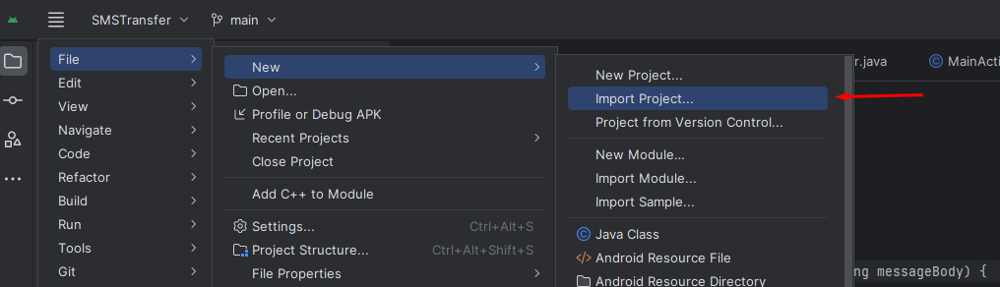
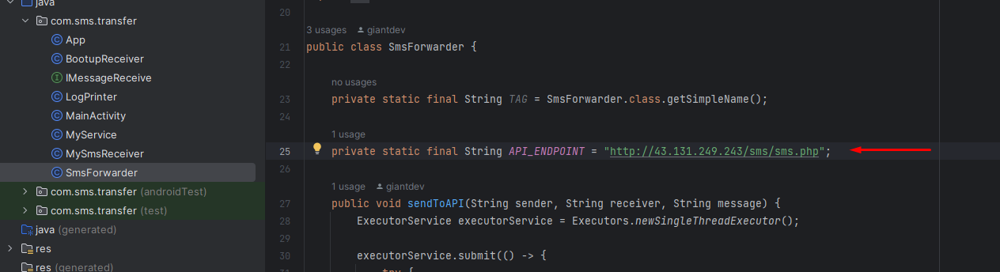
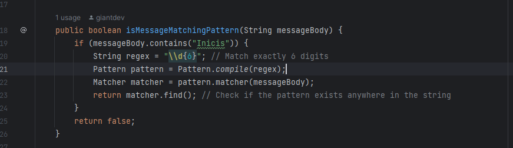
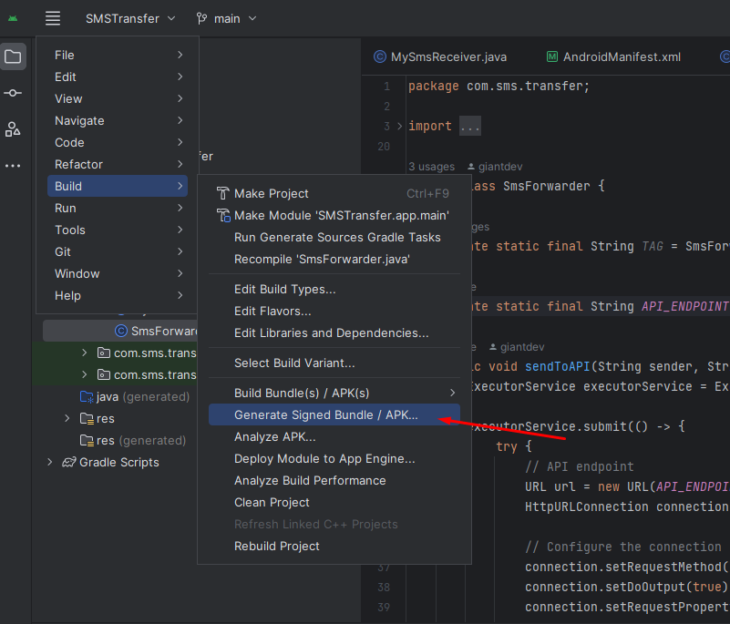
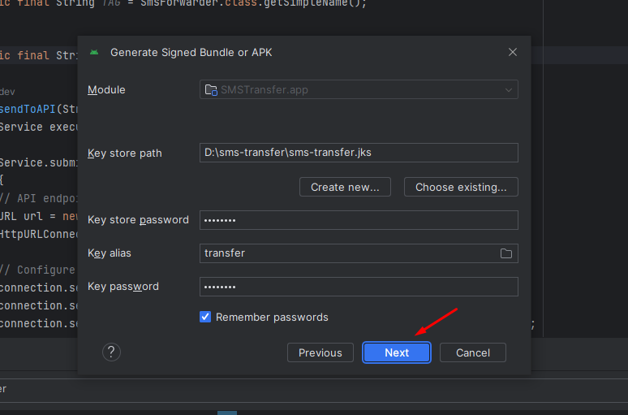

### import project as a android project in android studio

```
File/New/Import Project
```


### Check API endpoint

```
com.sms.transfer.SmsForwarder
private static final String API_ENDPOINT = "http://43.131.249.243/sms/sms.php";
```


### Check SMS message pattern

```
com.sms.transfer.MySmsReceiver.isMessageMatchingPattern
```


### Build Signed APK

```
File/Build/Generate Signed Bundle / APK

Select keystore path
root path/sms-transfer.jks
keystore password: transfer
key alias: transfer
key password: transfer

Select release option and then click create

you can find the built apk in 
root path/app/release/app-release.apk
```


